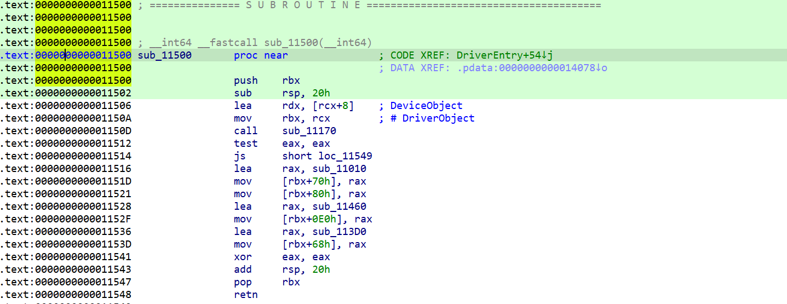

# ADV64DRV
 Reverse Engineering ADV64 Kernel Driver

 ## DESCRIPTION

File Name: ADV64DRV.sys

File Size: 13.80 KB (14128 bytes)

MD5: 778B7FEEA3C750D44745D3BF294BD4CE

SHA-1: 2261198385D62D2117F50F631652EDED0ECC71DB

[See full IDA disasembly](ida.asm)

## IMPORTS

Address&emsp;&emsp;&emsp;&emsp;&emsp;&emsp;&emsp;&emsp;Name&emsp;&emsp;&emsp;&emsp;&emsp;&emsp;&emsp;&emsp;&emsp;&emsp;&emsp;&emsp;&emsp;&emsp;Library

0000000000012000&emsp;&emsp;&emsp;HalTranslateBusAddress&emsp;&emsp;&emsp;&emsp;&emsp;&emsp;HAL

0000000000012010&emsp;&emsp;&emsp;RtlAppendUnicodeToString&emsp;&emsp;&emsp;&emsp;&ensp;ntoskrnl

0000000000012018&emsp;&emsp;&emsp;RtlInitUnicodeString&emsp;&emsp;&emsp;&emsp;&emsp;&emsp;&ensp;&ensp;&ensp;ntoskrnl

0000000000012020&emsp;&emsp;&emsp;MmUnmapIoSpace&emsp;&emsp;&emsp;&emsp;&emsp;&emsp;&emsp;&ensp;&ensp;ntoskrnl

0000000000012028&emsp;&emsp;&emsp;MmMapIoSpace&emsp;&emsp;&emsp;&emsp;&emsp;&emsp;&emsp;&emsp;&emsp;&nbsp;ntoskrnl

0000000000012030&emsp;&emsp;&emsp;IoWriteErrorLogEntry&emsp;&emsp;&emsp;&emsp;&emsp;&emsp;&emsp;ntoskrnl

0000000000012038&emsp;&emsp;&emsp;IoDeleteSymbolicLink&emsp;&emsp;&emsp;&emsp;&emsp;&emsp;&emsp;ntoskrnl

0000000000012040&emsp;&emsp;&emsp;IoDeleteDevice&emsp;&emsp;&emsp;&emsp;&emsp;&emsp;&emsp;&emsp;ntoskrnl

0000000000012048&emsp;&emsp;&emsp;IoCreateSymbolicLink&emsp;&emsp;&emsp;&emsp;&emsp;&emsp;ntoskrnl

0000000000012050&emsp;&emsp;&emsp;IoCreateDevice&emsp;&emsp;&emsp;&emsp;&emsp;&emsp;ntoskrnl

0000000000012058&emsp;&emsp;&emsp;KeBugCheckEx&emsp;&emsp;&emsp;&emsp;&emsp;&emsp;ntoskrnl

0000000000012060&emsp;&emsp;&emsp;IoAllocateErrorLogEntry&emsp;&emsp;&emsp;&emsp;&emsp;&emsp;ntoskrnl

0000000000012068&emsp;&emsp;&emsp;IofCompleteRequest&emsp;&emsp;&emsp;&emsp;&emsp;&emsp;ntoskrnl

## EXPORTS
Only DriverEntry

## DRIVER INITIALIZATION
The driver initialization function exists at offset *0x11500* which calls function *sub_11170* to initialize the device driver and create symbolic links. In the case of an error, the *IoWriteErrorLogEntry* routine queues the given error log packet to the system error logging thread.

### IRP DISPATCH ROUTINES

[sub_11010](sub_11010.asm) -> IRP_MJ_CREATE 

[sub_11010](sub_11010.asm) -> IRP_MJ_CLOSE

[sub_11460](sub_11460.asm) -> IRP_MJ_DEVICE_CONTROL

[sub_113D0](sub_113D0.asm) -> DRIVER_UNLOAD

The driver sets up a [driver unload function](driverunload.com) 

